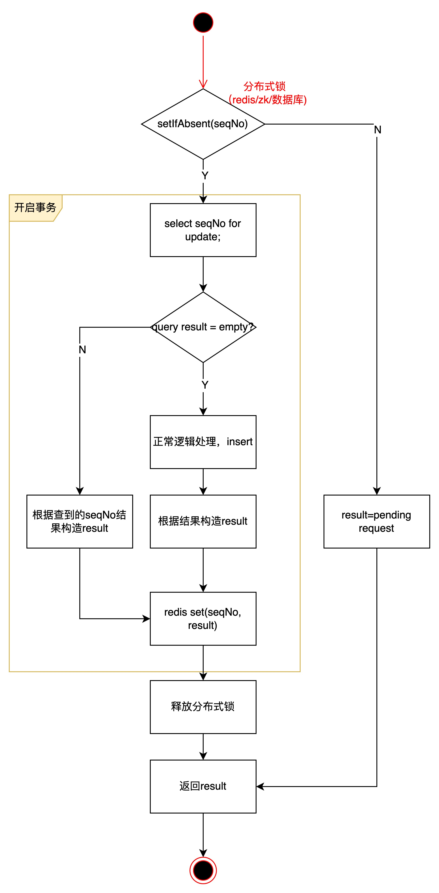

# maven打包源码

1. 在pom中添加

   ```xml
   <build>
           <pluginManagement>
               <plugins>
                   <plugin>
                       <groupId>org.apache.maven.plugins</groupId>
                       <artifactId>maven-source-plugin</artifactId>
                       <version>3.2.1</version>
                       <executions>
                           <execution>
                               <id>attach-sources</id>
                               <goals>
                                   <goal>jar</goal>
                               </goals>
                           </execution>
                       </executions>
                   </plugin>
               </plugins>
           </pluginManagement>
       </build>
   ```

   

2. 在deploy.sh文档中改为

   ```sh
   work_dir=$(cd $(dirname "$0"); pwd)
   cd $work_dir
   echo "当前工作目录是:$work_dir"
   
   echo "----- build approval-center ------"
   cd ../ && mvn clean source:jar deploy  -Dmaven.test.skip=true
   if [ $? -ne 0 ]; then
       echo "build approval-center error"
       exit 1
   fi
   echo "----- build approval-center success ------"
   ```

这样打包再nexus上会有两个jar包：正常的jar包以及带sources的jar包

引用的时候只需要正常引用即可，然后可以点击download source code


# 实现幂等



数据库分布式锁：

```java
// 数据库版分布式锁, 用status记录该条request的状态是I还是E，用msg记录request的返回结果
// 开启事务
lock = false;
try{ // 抢占seqNo锁
  	record = queryBySeqNo(seqNo); // for update
  	if(record == null){
      	insert seqNo into DB;
      	lock = true;
    }
}catch(Exception e){
  	rollback;
  	return "mysql error";
}

// 执行逻辑
// 开启事务
try{
  	record = queryBySeqNo(seqNo); // for update
  	if(lock){
      	//执行正常逻辑
      	//构造result
      	record.msg = result；
        update record;
    }else{
        if(msg = null){
          	return "pending request";
        }else{
          	return msg;
        }
    }
}catch(Exception e){
  	rollback;
  	record = queryBySeqNo(seqNo); // for update
  	msg = Result.fail();
  	update record;
}
```

redis分布式锁：

```java
// redis版本分布式锁
success = redis.setIfAbsent(seqNo,"1");
if(success){// 抢到分布式锁
  	// 开启事务
  	try{
      	recordList = queryBySeqNo(seqNo); //for update
      	if(recordList == null){
          	// 正常逻辑
          	// 构造result
        }else{
          	// 根据查询结构构造result
        }
      	commit;
    }catch(Exception e){
      	rollback;
      	result = fail;
    }finally{
      	redis.delete(seqNo)
    }  
}
return result;
```

# 缓存

## @Cacheable

注解在方法上，表示返回结果是可以缓存的——用相同的参数调用该方法时，会返回缓存中的值，不会真正执行该方法

```
1、方法运行之前，先去查询Cache（缓存组件），按照cacheNames指定的名字获取；
	（CacheManager先获取相应的缓存），第一次获取缓存如果没有Cache组件会自动创建。
2、去Cache中查找缓存的内容，使用一个key，默认就是方法的参数；
	key是按照某种策略生成的；默认是使用keyGenerator生成的，默认使用SimpleKeyGenerator生成key；
	SimpleKeyGenerator生成key的默认策略；
		如果没有参数；key=new SimpleKey()；
		如果有一个参数：key=参数的值
		如果有多个参数：key=new SimpleKey(params)；
3、没有查到缓存就调用目标方法；
4、将目标方法返回的结果，放进缓存
@Cacheable标注的方法执行之前先来检查缓存中有没有这个数据，默认按照参数的值作为key去查询缓存，
如果没有就运行方法并将结果放入缓存；以后再来调用就可以直接使用缓存中的数据；
```

