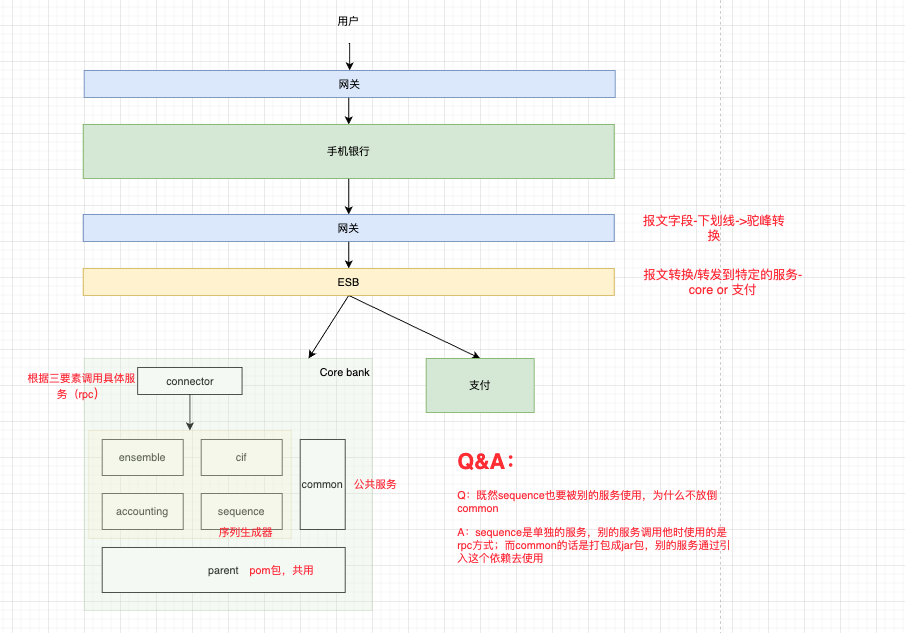
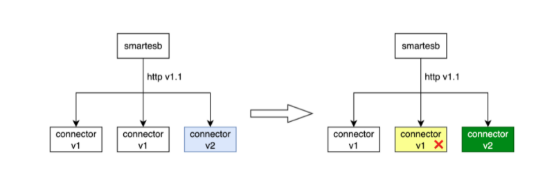
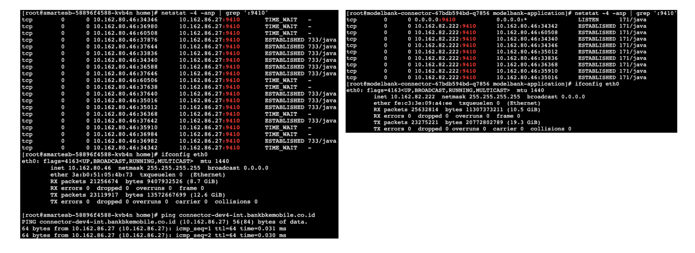
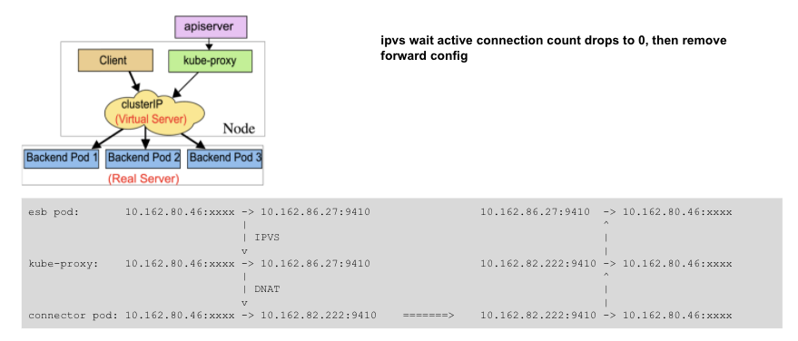

# k8s优雅停机和相关事宜分享

2021-11-29

## 1. banking框架

## 2. issue

- 当关闭k8s的时候，k8s会保证新的connection不会成功建立，但是smartesb和connector之间使用的是jetty
- jetty使用http1.1进行连接，http1.1会自动的重用connection
- 而优雅停机需要30s左右的时间去停止
- 因此，可能在这30s内，新的request又重用了这个旧的connection，但是这个conntor的容器已经被destroy了，所以就会报错

因此，除了要对k8s进行优化关闭外，还需要对jetty进行优雅关闭

### 2.1 k8s优雅停机步骤

1. 新起一个new pod，通过准备探针判断是否已经ready

2. 将old pod标记为terminating

3. 更新kube-proxy， 防止新的connection再建立到old pod

4. 运行preStop hook（自己配置的）

5. 发送sigterm到pid 1（old pod）

   **k8s只发送sigterm到pid 1！**

   *所以我们需要保证main process在pid 1上运行*

   *但是框架里的pid1是start.sh，所以需要修改脚本——通过exec去运行脚本而非nohup*

   *exec - 使用当前线程的上下文去跑新的program，执行后当前线程变成了新program*

6. 等到terminationGracePeriodSeconds秒，default=30s

7. 如果old pod还存在，发送sigkill （kill -9）杀死

## 3. relevant issues

netstat查看某个端口的连接时发现不对称

在smartesb（80.46）中 - 左图

- 从80.46到**86.27**的连接

在conntor（82.222）中 - 右图

- 从82.222到80.46的连接

Q1：所以这个86.27是啥？？

A1：VIP，相当于一个负载均衡？分配给不同的connector

Q2: 如何根据netstat去判断是谁主动断开连接

A2: 状态为TIME_WAIT的即为主动断开方

