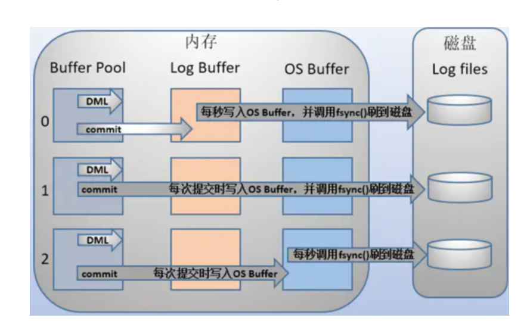

# mysql事务实现原理

## 1. summary

- 事务的隔离性

  锁 and MVCC

- 事务的原子性和持久性

  Redo Log

- 事务的一致性

  Undo log

## 2. Redo log

- innodb engine中产生

- 主要记录物理日志，即对磁盘上的数据进行的修改操作

- 用于恢复提交后的物理数据页， but只能恢复到最后一次提交的位置

  - 已提交但未写入ibd文件中的数据

- 分为

  - redo log buffer，内存中，易丢失
  - redo log file， 磁盘中，持久化

  先写入redo log buffer，再根据一定的策略刷到rodo log file中实现持久化

  - 事务提交后每秒将buffer的数据写入内核缓冲并且fsync刷入磁盘。(0)
  - 事务提交时将buffer数据写入内核缓冲区并且调用fsync将日志写到磁盘上，这样可以保证数据不丢失。(1)
  - 事务提交时将buffer写入内核缓冲区，之后每条调用fsync将内核缓存刷入磁盘。(2)

  

  

- 刷盘机制

  - 开启事务时，根据`innodb_flush_log_at_trx_commit`决定，即上图中的0，1，2
  - 每秒刷新一次，频率根据`innodb_flush_log_at_timeout`决定，default=1s
  - 当log buffer已经使用的内存超过一半
  - writePos追上了checkPoint

- 写入机制

  循环覆盖写

  - writePos

    当前记录所在位置

  - checkPoint

    当前擦除所在位置（已持久化到磁盘）

  - writePos和checkPoint之间

    可写入数据的位置

- LSN机制

  除了存在于redo log外，还存在于数据页

  - 每个数据页的头部，有参数记录了当前页最终的LSN
  - 将数据页的LSN和redo log中的LSN进行对比
    - 若数据页LSN < redo log LSN, 则表示丢失了部分数据
    - 需要用redo log来恢复数据

## 3. Undo log

- 作用

  - 回滚事务

    启动事务前，会先将要修改的数据记录存储到undo log，若需要回滚，根据undo log对未提交的事务进行回滚

    事务提交后，将当前事务对应的undo log放入待删除列表，后续由后台进程进行删除

  - 实现MVCC

    数据被别的事务锁定时，可以根据undo log分析出当前数据之前的版本，返回给客户端

- 记录的是逻辑日志（与操作相反的语句）

- 事务执行过程中产生的undo log也需要进行持久化

  - 产生redo log
  - 因此，数据库崩溃时先做redo log数据恢复，再做undo log 回滚

- 存储方式

  采用段进行管理

- 如果实现MVCC

  - undo log 版本链

    undo log中的每一条数据都会有记录指向上个版本的undo log

    当一行数据有多个版本时，就会有多条 undo log 日志，undo log 之间通过 roll_pointer 指针连接，这样就形成了一个 undo log 版本链

  - 根据read view和undo log 版本链实现MVCC

    https://www.modb.pro/db/78749

