# 分布式事务

## prepare

### 1. DTP模型

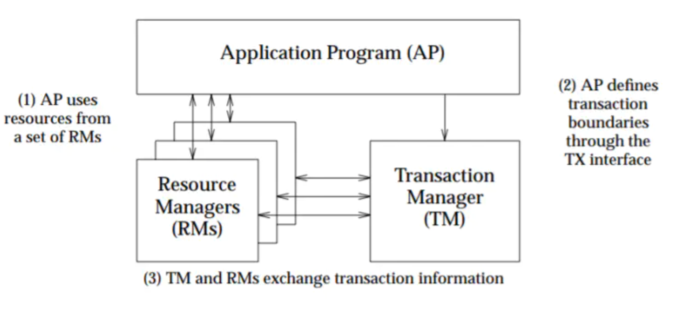

AP：定义事务边界，定义事务的开始和结束，并在事务边界内对Resources进行操作

RM：事务参与者，如数据库、文件系统等，并且提供访问资源的方式

TM：事务协调者，负责分配事务唯一标志，监控事务的执行进度，并且负责事务的提交和回滚等操作

### 2. 系统架构演变

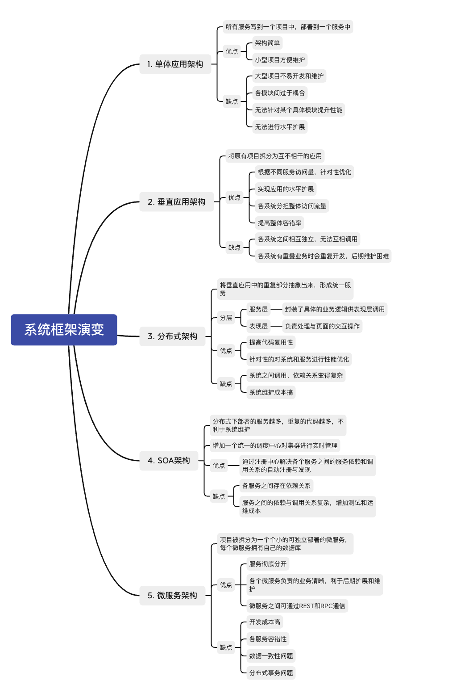

### 3. 分布式事务场景

- 跨JVM进程

  微服务项目，各服务通过REST/RPC协同完成业务操作

  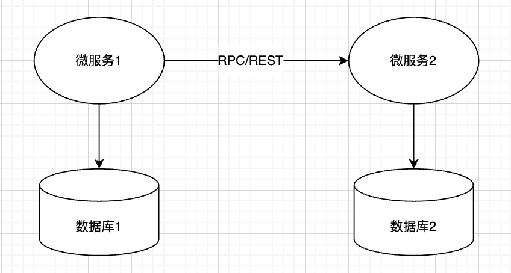

- 跨数据库实例

  数据分布在不同的数据库实例，需要通过不同的数据库连接会话来操作数据库中的数据

  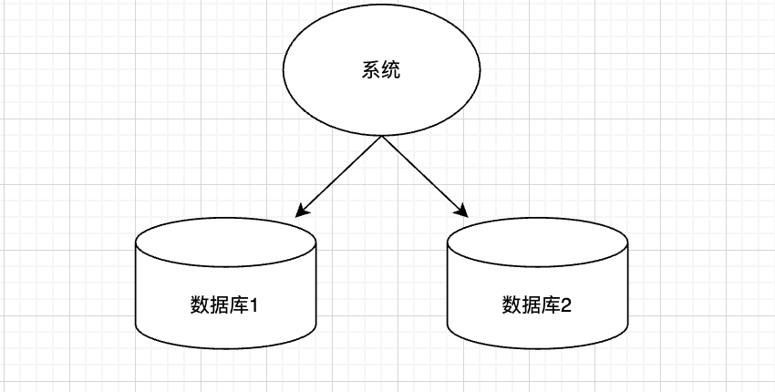

- 多服务访问单数据库

  多个微服务访问同一个数据库，本质上也是通过不同的数据库会话来操作数据库

  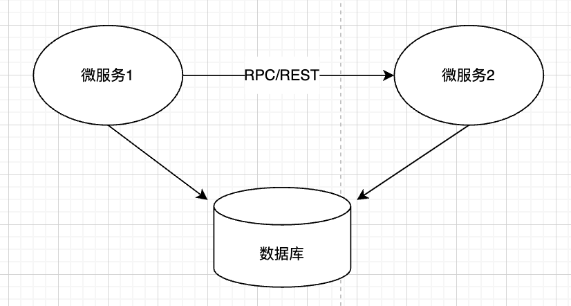

### 4. CAP理论

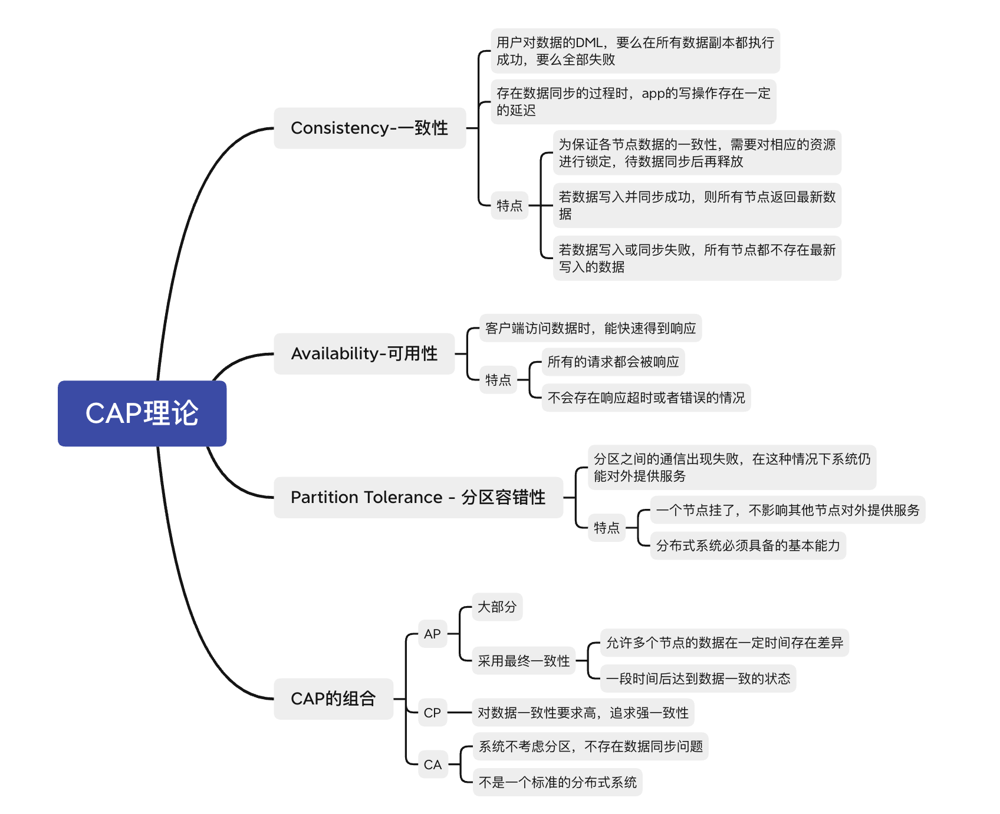

### 5. BASE理论

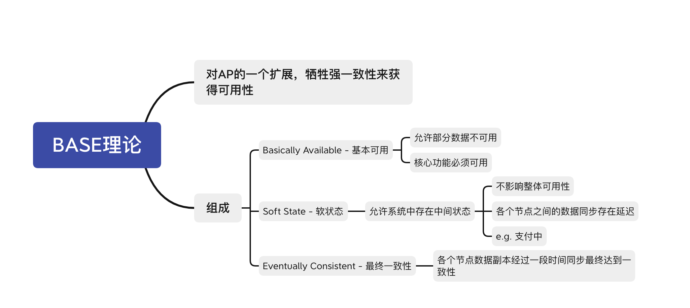

### 6. 分布式事务解决方案

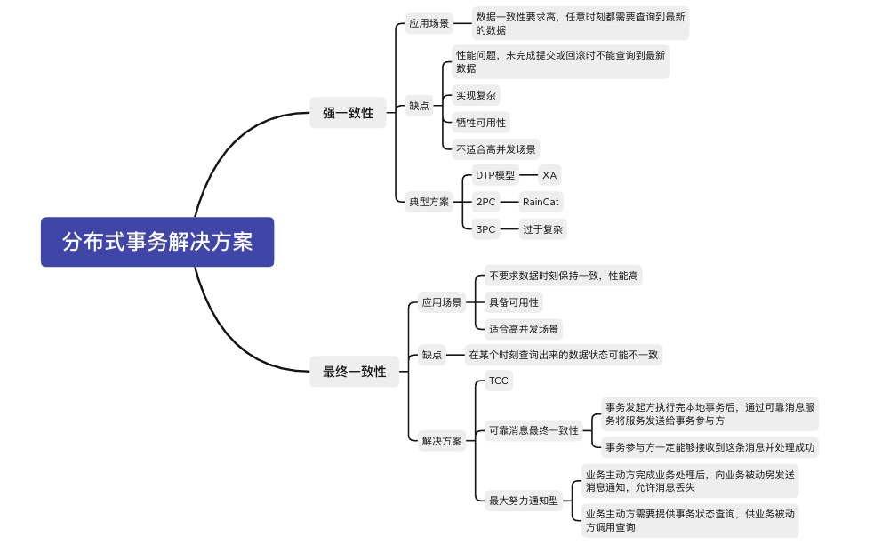

## 

## 1. XA

### XA规范

```tex
- xa_start 开启或恢复一个事务分支，并且管理XID到调用线程
- xa_end 取消当前线程与事务分支的关联
- xa_prepare 询问RM是否准备好提交事务分支
- xa_commit 通知RM提交事务
- xa_rollback 通知RM回滚事务
- xa_recover 列出处于prepare的XA的事务分支
```

### XA二阶段提交

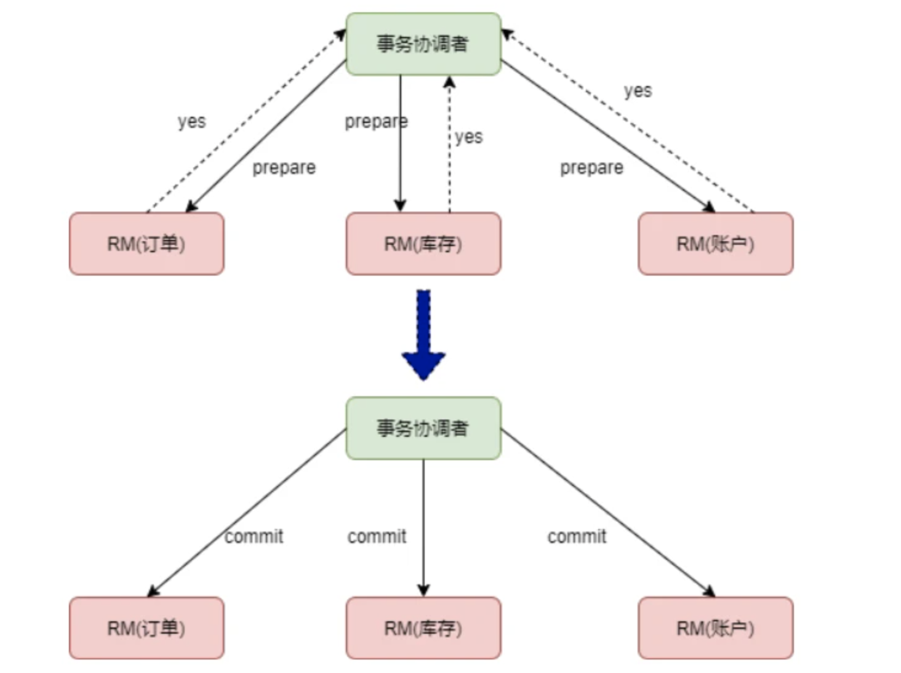

```tex
一阶段：执行xa_prepare.
			- TM通知各个RM准备提交他们的事务分支。RM收到通知后执行xa_preparet语句
二阶段：执行xa_commit/rollback.
			- TM根据各个RM的xa_prepare结果决定是回滚还是提交事务
			- 若所有RM都预提交成功，则TM通知所有RM执行xa_commit
			- 若有RM的预提交执行失败，则TM通知所有RM执行xa_rollback
```

### XID

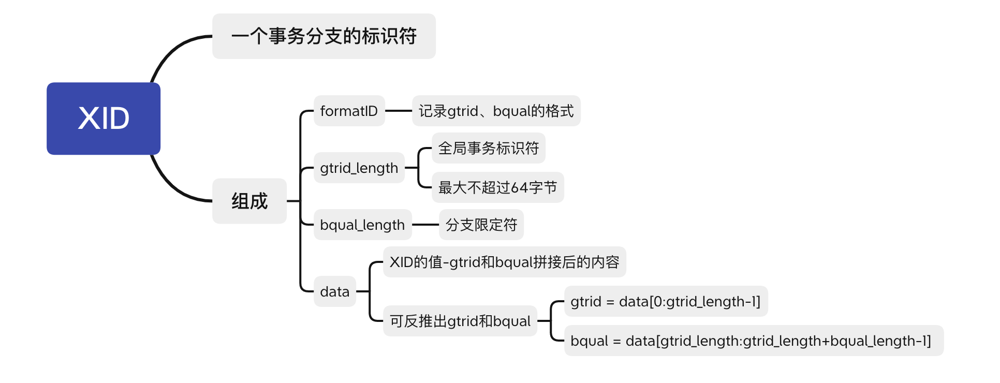

### myql xa流程

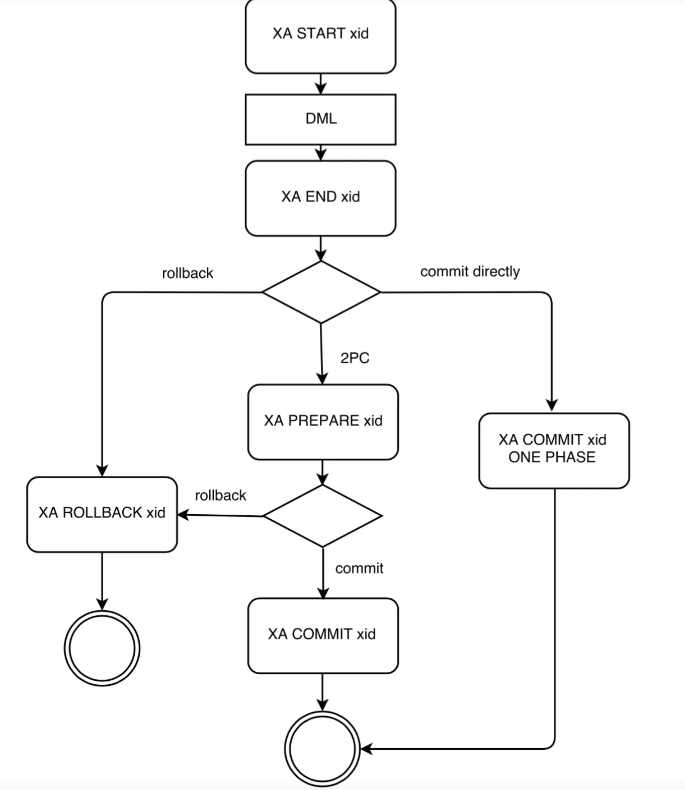

```tex
1. XA START xid 开启一个xid为xid的XA事务；事务的状态变为ACTIVE
2. 执行具体的DML
3. XA END xid 结束一个XA事务，事务的状态变为IDLE
4. XA PREPARE xid 将事务置为PREPARE状态（可略过，IDLE可直接提交）
5. XA COMMIT xid 提交事务，事务的状态变为COMMITED
```

### 缺点

1. 同步阻塞

   本地事务在prepare阶段锁定资源，若别的事务想要修改锁定的资源，必须等待

2. TM节点单点故障

   若第一阶段prepare成功了，但是第二阶段TM发出commit指令前宕机了，所有RM都处于锁定状态，事务将无限等待下去

3. 数据不一致

   第一阶段prepare成功，但第二阶段协调节点向某个节点发送commit命令丢失，则会导致数据不一致

## 2. TCC

采用补偿机制，核心思想：针对每个操作，都要注册一个与其对应的确定和补偿（撤销）操作

### 三阶段提交

```tex
1. try阶段对业务系统做检测及资源预留
2. confirm阶段对业务系统做确定提交，Try阶段所有分支事务执行成功后开始执行Confirm。通常情况下，采用TCC则认为Confirm阶段是不会出错的
3. cancle阶段，在业务执行错误需要回滚的状态下执行分支事务的业务取消，预留资源释放。通常情况下，采用TCC则认为Cancel阶段也是一定成功的。若Cancel阶段真的出错了，需引入重试机制或人工处理。
```

**按照TCC的协议，Confirm和Cancel是只返回成功，不会返回失败。如果由于网络问题，或者服务器临时故障，那么事务管理器会进行重试，最终成功。 -》 幂等性**

TCC三阶段与关系型数据库的实务操作的类比：

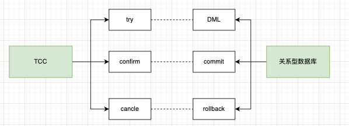

### 网络异常

由于网络可能出现异常，会导致重复请求，所以要求三个分支都具备幂等性。

例如Confirm阶段，业务已经处理，但是由于网络临时故障，导致服务器返回结果未收到，那么事务管理器会进行重试，业务会收到第二次Confirm处理，此时要求幂等。

对于TCC以及其他分布式事务，不仅要处理幂等，还需要处空补偿和防悬挂

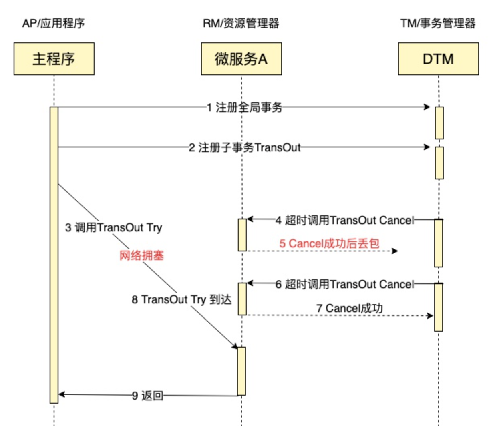

```tex
1. AP注册全局事务
2. AP注册子事务transout
3. AP调用transOut try，此时网络阻塞
4. 超时，DTM调用transout cancle
5. cancel成功后，发送成功消息时丢包 （空事务）
6. DTM重新发送cancle指令
7. cancle成功（幂等）
8. 此时transout try到达RM
9. 返回（处理悬挂，其二阶段Cancel接口比Try接口先执行）
```

### example

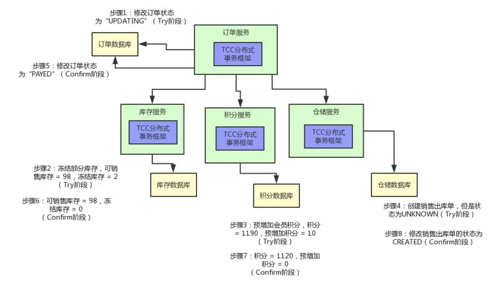

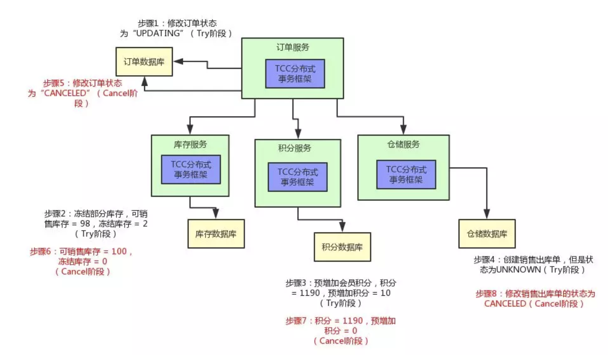

### 缺点

TCC 的 Try、Confirm 和 Cancel 操作功能要按具体业务来实现，业务耦合度较高，提高了开发成本。


## 3. XA和TCC的区别

1. XA是资源分布式事务，强一致性，整个过程中数据一直锁住
2. TCC是业务的分布式事务，最终一致性，不会出现长事务的锁风险
